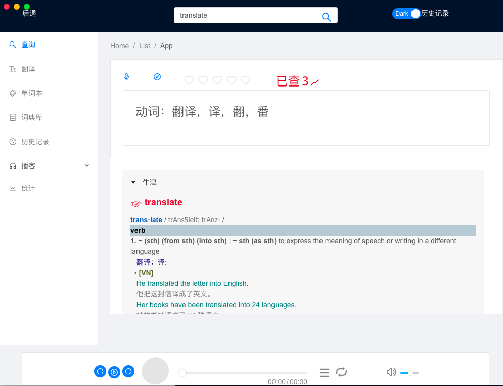
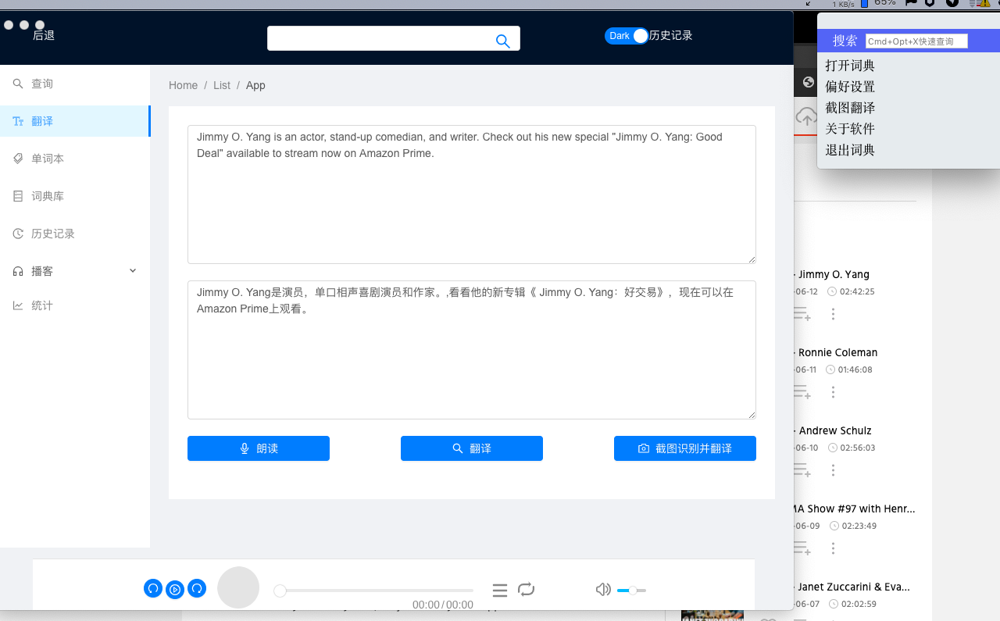
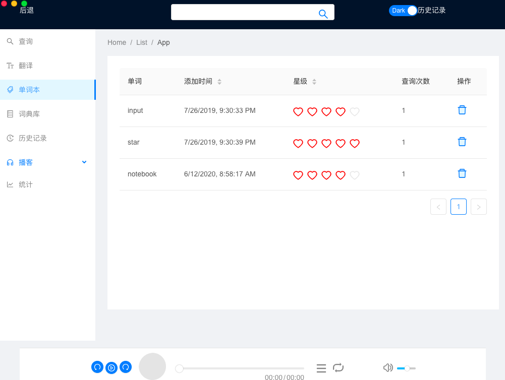
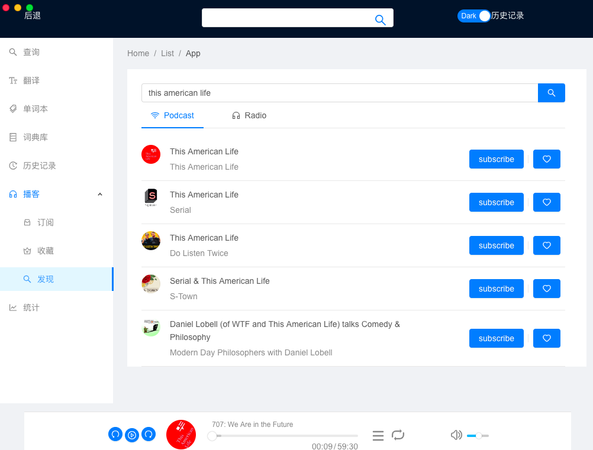
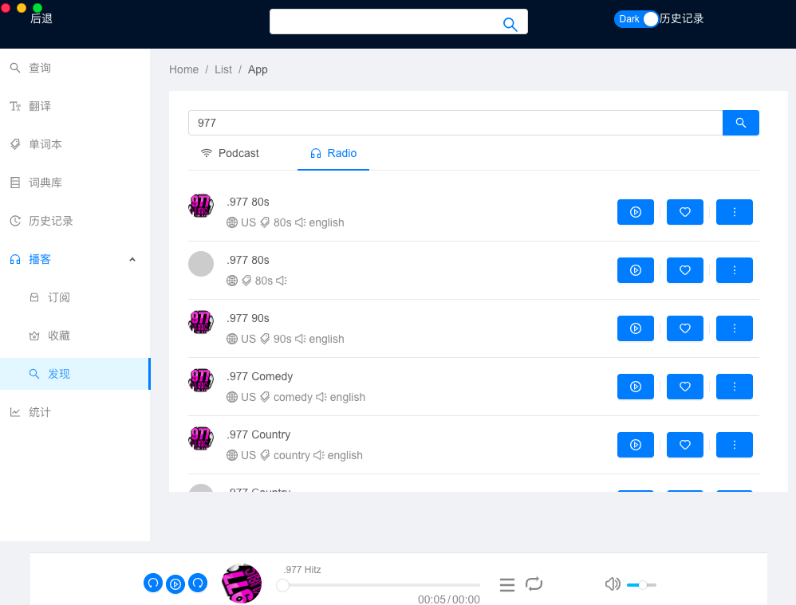
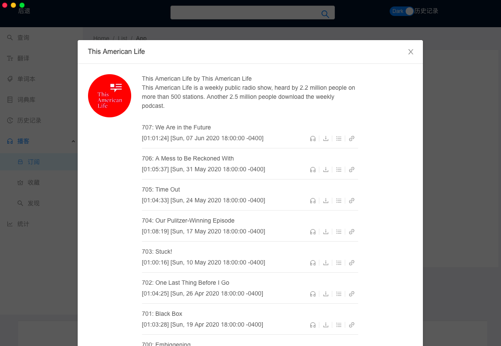

# Yamdict

> A English learning tool with dictionary,translation,OCR,podcast,online radio

## 1. Dictionary

### 1.1 Local Dictionary

using `.mdx` dictionary file

### 1.2 Online Dictionary 

use `Google` for Translate and pronunciation

## 2. Translate

Take a screenshot using shortcut from the status bar, extract the sentence and word , read it ,get the translate result of it.

## 3. Notebook

You can favourite and rate the word for later exercise

## 4. Dictionary

Not satisfy with the search result? You can use your own dictionary.

## 5. Search Records

Check what and when you searched. Which word,search times,search time.

## 6. Podcast & Radio

### 6.1 Discover

Search the podcast/video you like,subscribe it,listen it. 

### 6.2 Subscribe

Get your favorite podcast latest episode.Listen it ,download it.
  
# 7 Docs

It's still underdevelopment. But ready to use , just clone it and `yarn dev` 

# 8. Thanks 

`framework`: electron-react-boilerplate [github](https://github.com/electron-react-boilerplate/electron-react-boilerplate)

`mdict-js`: mdict parser [github](https://github.com/fengdh/mdict-js)

`mdict-analysis`: mdict file analyse [github](https://github.com/csarron/mdict-analysis)

`react-music-player`: radio&podcast player [github](https://github.com/neroneroffy/react-music-player)

`ScreenShot Tool`: ScreenShot Tool [jujin](https://juejin.im/post/5bcedc98f265da0abc2ba45d)

`podcast search api`: [apple itunes api](https://affiliate.itunes.apple.com/resources/documentation/itunes-store-web-service-search-api/)

`radio search api`: [radio-browser](http://www.radio-browser.info/gui/#!/)

`ocr`: [Tencent](https://ai.qq.com/doc/ocrgeneralocr.shtml)

# 9. Lisence

MIT ©

